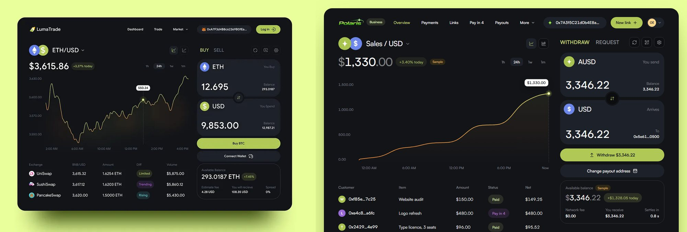
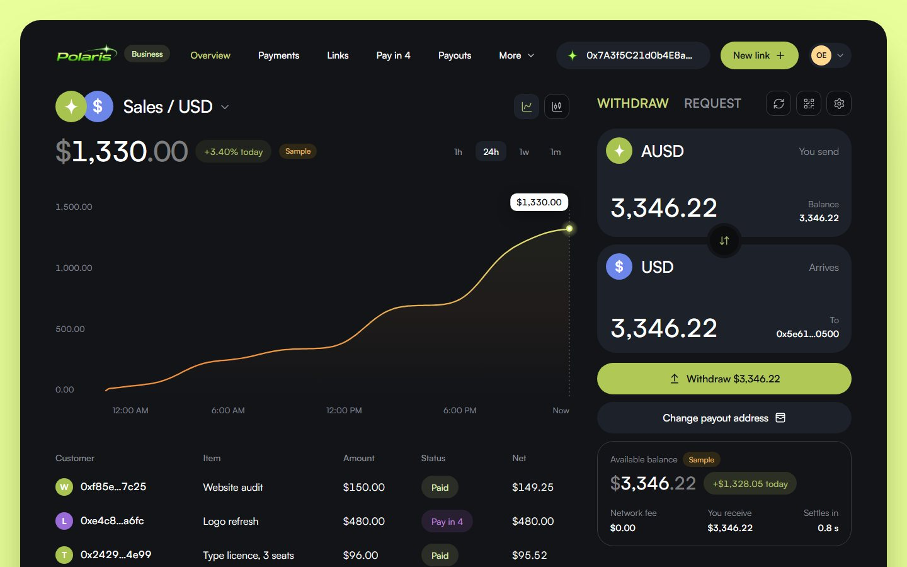
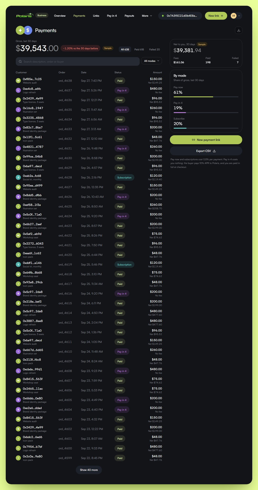
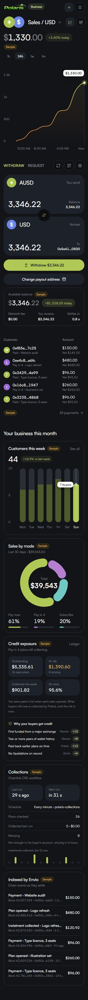
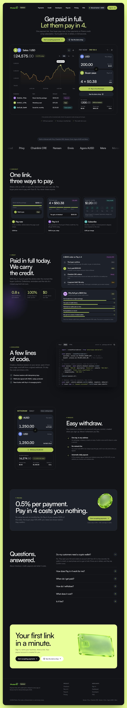
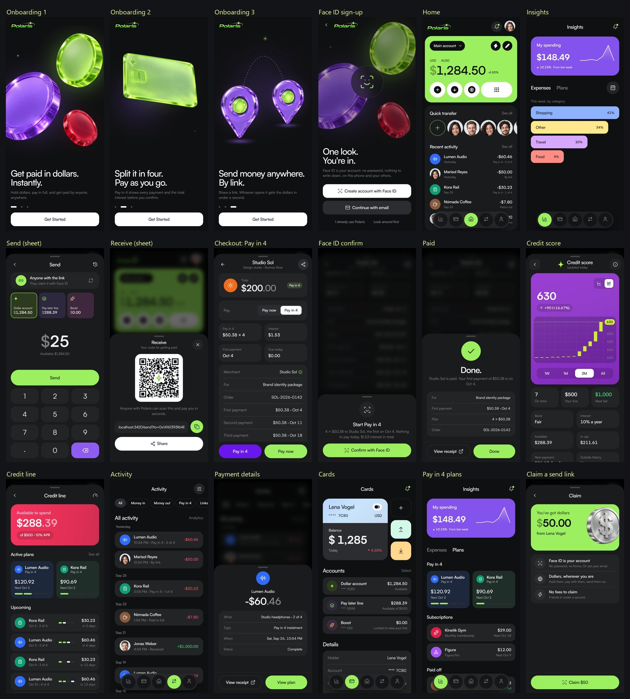
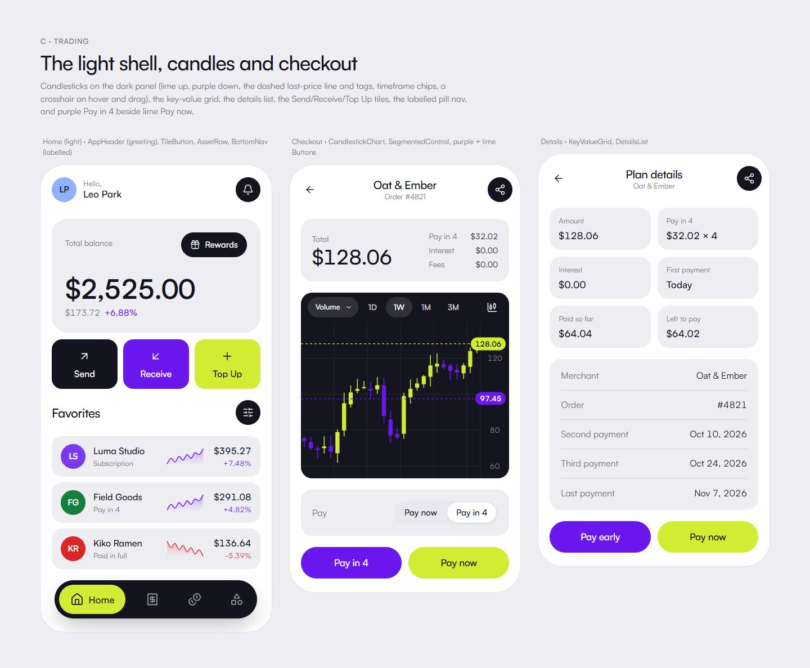
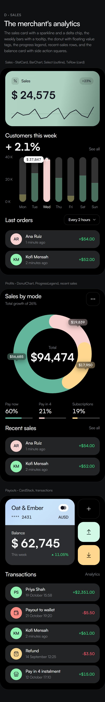

# Polaris

**Stripe for every app on Monad.** One link to get paid now, later, or every
month.

- **The Polaris app** (buyers and senders): open a link, create an account with
  Face ID ([Mera](https://docs.monad.xyz/guides/mera) passkeys), and pay in
  dollars (AUSD). Pay in full, in four instalments against a credit line read
  from your on-chain history, or on a subscription, and send dollars across
  borders by link. No wallet, no gas, no seed phrase.
- **Polaris for Business** (merchants and platforms): payment links, a checkout
  API and SDK, a collections dashboard, webhooks, and one-tap or automatic
  payouts. Built on [Privy](https://privy.io).
- **The credit engine**: undercollateralized Pay in 4 on Monad at 10% APR (a
  $200 order is 4 × $50.38, nothing due at checkout). The merchant is paid in
  full up front. Credit is underwritten and instalments are collected by
  [Chainlink CRE](https://docs.chain.link/cre) workflows, using
  [Nansen](https://nansen.ai) and Zerion wallet data, and indexed by
  [Envio](https://envio.dev).

Built for [Monad Metropolis](https://monad.xyz/developers/hackathons/metropolis),
Track 02: Consumer Products & Payments. The plan is in
[`docs/plan.md`](docs/plan.md).

> **Status (28 Sep 2026):** the whole product runs end to end on a local chain
> with one command (`pnpm demo:local`, below). Nothing is deployed to Monad
> testnet yet: the deployer is unfunded and there is no testnet AUSD (see
> [What only you can do](#what-only-you-can-do)).

---

## Run it

Node 22.6+ and pnpm 10.

```bash
pnpm install
pnpm demo:local
```

`pnpm demo:local` ([`scripts/demo-local.mjs`](scripts/demo-local.mjs)) starts
everything on this machine, with nothing live (no Privy login, no CRE login,
no public chain):

| What | Where | How it runs |
|---|---|---|
| A Hardhat node, chain 31337 | http://127.0.0.1:8545 | every contract deployed by `packages/contracts/scripts/deploy-monad.js` (MockAUSD, a funded credit pool, a local CRE forwarder) |
| Polaris for Business | http://localhost:3100 | the dev relayer adapter (a local key held to the production relayer policy), a fresh SQLite store, Halcyon's merchant seeded with test API keys and a webhook, registered on `MerchantRegistry` through the dashboard's registration API; the dashboard is signed in for Halcyon with a random local session |
| The CRE underwriting trigger | http://127.0.0.1:2000/trigger | `workflows` `trigger:local`: the real `polaris-underwrite` handler on the CRE SDK's test runtime, with fixture evidence |
| The Polaris app | http://localhost:3000 | the hosted checkout; the dev signer stands in for Face ID (badge on every screen) |
| Halcyon, the demo shop | http://127.0.0.1:3600 | `polarispay-sdk` against the real API and checkout (not its dev mock) |
| A faucet | http://127.0.0.1:3650/mint | test dollars; the app's **Add money** offers it on this chain |
| The CRE collections cron | every minute | `workflows` `collections:local`: the real `polaris-collections` handler on the CRE SDK's test runtime; it collects due Pay in 4 instalments through `CollectionsReceiver`, reports each run to the API (the dashboard's Collections card, `installment.collected` webhooks) and logs to `.demo/logs/cre-collections.log` |

Then: open the shop, add something to the bag, **check out with Polaris**. The
checkout opens in a popup (the app's `/pay/[id]` sheet). Pay now, or choose
Pay in 4: a new buyer has no line, so **Raise your limit** runs the CRE
underwriting workflow first. The shop's order is marked paid by the Polaris
webhook, and the merchant dashboard at http://localhost:3100/dashboard shows
the payment and the plan. Before it prints its URLs, `demo:local` opens every
page and API route once, so no first click waits for `next dev` to compile.
`DEMO_FAST_PLANS=1` makes Pay in 4 instalments a minute apart instead of a
week, so the collections run shows on camera (instalment 1 is collected about
two minutes after checkout; Pay in 4's 10% APR is pro-rated over those minutes, so the plan shows $0.00 interest). Ports move with `DEMO_NODE_PORT`,
`DEMO_BUSINESS_PORT`, `DEMO_APP_PORT`, `DEMO_SHOP_PORT`, `DEMO_TRIGGER_PORT`
and `DEMO_FAUCET_PORT`. Logs and state are in `.demo/`; `.demo/demo.json`
has every URL of the run.

`pnpm demo:e2e` ([`scripts/demo-e2e.cjs`](scripts/demo-e2e.cjs), needs
Playwright: `PLAYWRIGHT_MODULE=<path>`, and `CHROMIUM=<chrome.exe>` if its
browser build isn't installed) drives that run headless and writes the
screenshots in [`docs/demo`](docs/demo). It finds the run's URLs in
`.demo/demo.json` (or `APP`, `SHOP`, `BUSINESS`, `RPC` and `FAUCET`). The committed ones are from a run in
which all 15 steps passed:

| Step | Screenshot |
|---|---|
| A buyer account (dev signer), $1,000 from the local faucet, read from the chain | [`01-app-home-funded`](docs/demo/01-app-home-funded.png) |
| Halcyon → bag → checkout, Pay now | [`10-paynow-3-shop-checkout`](docs/demo/10-paynow-3-shop-checkout.png) |
| The Polaris checkout in the shop's popup, Face ID confirm | [`10-paynow-4-app-checkout-popup`](docs/demo/10-paynow-4-app-checkout-popup.png), [`10-paynow-5-app-confirm`](docs/demo/10-paynow-5-app-confirm.png) |
| The popup posts `completed` and closes; the webhook marks the order paid | [`10-paynow-7-shop-order-paid`](docs/demo/10-paynow-7-shop-order-paid.png) |
| Pay in 4: the checkout opens on Pay in 4; Raise your limit | [`20-payin4-4-app-checkout-popup`](docs/demo/20-payin4-4-app-checkout-popup.png), [`20-payin4-5-raise-your-limit`](docs/demo/20-payin4-5-raise-your-limit.png) |
| The CRE underwriting workflow opens a $1,000 line on chain, with its reasons | [`20-payin4-6-limit-raised`](docs/demo/20-payin4-6-limit-raised.png) |
| 4 × $87.92, nothing due today; confirm | [`20-payin4-7-app-checkout-with-line`](docs/demo/20-payin4-7-app-checkout-with-line.png), [`20-payin4-8-app-confirm`](docs/demo/20-payin4-8-app-confirm.png) |
| The shop's order, paid through a Polaris plan (`plan.opened` webhook) | [`20-payin4-9-shop-order-plan`](docs/demo/20-payin4-9-shop-order-plan.png) |
| Subscribe: the Coffee Club, monthly, in the Polaris popup; the first month charged on chain | [`50-subscribe-2-app-checkout-popup`](docs/demo/50-subscribe-2-app-checkout-popup.png), [`50-subscribe-4-shop-order`](docs/demo/50-subscribe-4-shop-order.png) |
| Pay directly with a wallet: `polarispay-sdk` `pay()`, one signature, relayed gas-free | [`60-wallet-1-shop-checkout`](docs/demo/60-wallet-1-shop-checkout.png), [`60-wallet-2-shop-order-paid`](docs/demo/60-wallet-2-shop-order-paid.png) |
| The buyer's app afterwards: balance, credit line, the plan | [`30-app-home-after`](docs/demo/30-app-home-after.png), [`31-app-credit-line`](docs/demo/31-app-credit-line.png), [`32-app-pay-in-4-plans`](docs/demo/32-app-pay-in-4-plans.png) |
| The dashboard: payments, Envio feed and credit reasons, the plan, registration | [`40-dashboard-overview`](docs/demo/40-dashboard-overview.png), [`41-dashboard-panels`](docs/demo/41-dashboard-panels.png), [`42-dashboard-payments`](docs/demo/42-dashboard-payments.png), [`43-dashboard-pay-in-4`](docs/demo/43-dashboard-pay-in-4.png), [`44-dashboard-settings-registered`](docs/demo/44-dashboard-settings-registered.png) |

### Each app on its own

[`.claude/launch.json`](.claude/launch.json) has all four dev servers:

| App | Command | Port |
|---|---|---|
| The Polaris app | `pnpm --filter @polaris/app dev` (`next dev -p 3000`) | 3000 |
| Polaris for Business | `pnpm --filter @polaris/business dev` | 3100 |
| The Polaris landing page | `pnpm --filter @polaris/landing dev` | 3200 |
| Halcyon, the demo shop | `pnpm --filter @polaris/shop dev` | 3600 |

On their own, without `NEXT_PUBLIC_POLARIS_API_URL`, the app is an offline
demo and says so on every screen ("Demo mode · sample data, nothing is on
chain"); the dashboard has a development-only sample session
(`POLARIS_DEV_MOCK_SESSION=1`); and the shop uses its own labelled dev mock of
the API. Each app's README lists its environment.

### Tests and builds

| Package | Command | Result on this branch |
|---|---|---|
| Contracts | `pnpm --filter @polarispay/contracts test` | 467 passing |
| `polarispay-sdk` | `pnpm --filter polarispay-sdk test`, `build` | 146 passing; ESM and CJS builds |
| Underwriting | `pnpm --filter @polarispay/underwriting test`, `typecheck`, `build` | 263 passing |
| Gateway | `pnpm --filter @polarispay/gateway test` | 7 passing |
| `@polaris/db` | `pnpm --filter @polaris/db test` | 29 passing |
| Indexer client | `pnpm --filter @polarispay/indexer-client test` | 56 passing |
| Envio indexer (the Windows-runnable part) | `node packages/indexer/scripts/generate.mjs --check` | config and schema in sync (codegen and its tests run in WSL or CI: `packages/indexer/scripts/wsl.sh test`) |
| CRE workflows | `pnpm --filter @polaris/cre-workflows test`, `typecheck`, `build` (WASM; needs the CRE CLI: `cre:install`, or `CRE_BIN`) | 101 passing; both workflows compile to WASM |
| Polaris for Business | `pnpm --filter @polaris/business test`, `typecheck`, `lint`, `build` | 211 passing; the API auth check covers every route |
| The Polaris app | `pnpm --filter @polaris/app typecheck`, `lint`, `check:signatures`, `build` | 43 signature checks against the Solidity typehashes |
| Halcyon | `pnpm --filter @polaris/shop test`, `typecheck`, `lint`, `build` | 85 passing; the build proves no dev mock ships |
| Landing | `pnpm --filter @polaris/landing typecheck`, `build` | builds |
| End to end | `pnpm demo:local` + `pnpm demo:e2e` | 15 of 15 steps (Pay now, Pay in 4 with CRE underwriting, Subscribe, direct wallet pay, the dashboard); [`docs/demo`](docs/demo) |
| | `pnpm --filter @polaris/business e2e:local` | 13 of 13 checks (SDK sessions, relayed Pay now and Pay in 4, verified webhooks, a collection) |
| | `pnpm --filter @polarispay/contracts e2e:local` | all nine flows; the buyer, sender and freelancer never hold MON |
| | `pnpm --filter @polaris/cre-workflows e2e:local` | 7 passing (both workflows against real contracts on a local node) |
| Lockfile | `pnpm install --frozen-lockfile` | passes |

---

## Components

| Path | What it is |
|---|---|
| [`apps/app`](apps/app/README.md) | **The Polaris app**: the buyer's installable PWA, phone and desktop layouts. Face ID accounts (Mera), the hosted checkout `/pay/[id]` (Pay now, Pay in 4, Subscribe), send by link, plans, the credit line and score. Reads the chain and the API (`src/lib/data/live.ts`); an offline demo without the API |
| [`apps/business`](apps/business/README.md) | **Polaris for Business**: the merchant landing, Privy sign-in, the dashboard (payments, links, Pay in 4 ledger, payouts, developers, settings), and the API: checkout sessions, the relayer (`/api/relay`), webhooks, payouts, merchant registration, CRE underwriting requests and callbacks, the buyer's book |
| [`apps/shop`](apps/shop/README.md) | **Halcyon**, a demo store paying through `polarispay-sdk`: Pay now, Pay in 4, a subscription and direct wallet payment, with signed webhooks |
| `apps/landing` | The Polaris landing page |
| [`apps/gateway`](apps/gateway/README.md) | The underwriting API (`/v1/underwrite`, `/v1/explain`) on port 3510 |
| [`packages/contracts`](packages/contracts/README.md) | Solidity: `PolarisCheckout` (Pay now, Pay in 4, Subscribe), `PolarisLoanEngine`, `ScoreManager`, `PolarisPayments`, `PolarisSend`, `MerchantRegistry`, `CollateralVault`, `BatchSettlement`, the CRE receivers; deploy, local end to end, ABIs |
| [`packages/sdk`](packages/sdk/README.md) | `polarispay-sdk` 0.3: server client (sessions, webhooks), the checkout popup and its v1 postMessage protocol, React components, Pay in 4 quotes on the engine's schedule |
| [`packages/underwriting`](packages/underwriting/README.md) | Nansen-powered underwriting: provider clients, the Facts the DON attests, the thin-file gate (the contract's), the score, the Pay in 4 decision and plain-language reasons |
| [`packages/indexer`](packages/indexer/README.md) | The Envio HyperIndex indexer for every Polaris event, with a webhook outbox |
| `packages/indexer/client` | `@polarispay/indexer-client`: typed queries the dashboard, the CRE collections workflow and webhooks use |
| `packages/db` | Polaris for Business storage (SQLite or memory), API keys, webhook signing |
| [`packages/fx`](packages/fx/README.md) | Chainlink FX rates for the local-currency line: the verified feed table (Monad mainnet, Ethereum, Polygon, Base), a cached viem reader, the display formatting |
| [`packages/ui`](packages/ui/README.md) | The shared component library both web apps are built from (`/gallery` in each) |
| `packages/brand` | The Polaris mark and wordmark |
| `packages/keeperhub` | The dunning ladder the collections path uses |
| [`workflows`](workflows/README.md) | The Chainlink CRE workflows: `polaris-underwrite` (HTTP) and `polaris-collections` (cron), and `trigger:local` |
| `scripts` | `demo-local.mjs` (`pnpm demo:local`), `demo-e2e.cjs` (`pnpm demo:e2e`), the Lottie generators |
| `docs` | [`plan.md`](docs/plan.md), the design contract (`design/system.md`), research, [`demo`](docs/demo) |

---

## Bounty evidence

What each sponsor asks for, where this repository meets it, and how to check.
"Local" means the `pnpm demo:local` chain; nothing is on Monad testnet yet.

### Monad (Track 02: consumer products and payments)

| Requirement | Where | Verify |
|---|---|---|
| A consumer payments product on Monad | Pay by link, Pay now, Pay in 4, subscriptions, send by link, payouts: `packages/contracts/contracts/PolarisCheckout.sol`, `PolarisSend.sol`, `apps/app`, `apps/business` | `pnpm demo:local`, `docs/demo` |
| Gasless for the user | Every buyer action is an EIP-712 / ERC-3009 signature relayed by `apps/business` `POST /api/relay`; the buyer holds no MON | `pnpm --filter @polarispay/contracts e2e:local` (buyer, sender and freelancer end with 0 MON) |
| Contract addresses on a Monad network | *Not yet*: `deploy:monad` is ready and refuses mainnet | [What only you can do](#what-only-you-can-do), step 1 |

### Agora: AUSD cross-border payments

| Requirement | Where | Verify |
|---|---|---|
| Users send AUSD across borders | `PolarisSend` escrows AUSD by ERC-3009 against a link key; the app's Send and Claim (`apps/app/src/sheets/send.tsx`, `claim.tsx`); AUSD's own EIP-712 domain (`Agora Dollar`, `1`) | contracts `e2e:local` steps 8-9; `apps/app` `check:signatures` |
| Real balances and activity | `apps/app/src/lib/data/live.ts`: `AUSD.balanceOf`, the API's record of chain events; the offline demo is labelled on every screen and never links a made-up hash | `docs/demo/01-app-home-funded.png`, `30-app-home-after.png` |
| Local currency | Shown next to dollars at the live **Chainlink** rate, with its age ("≈ ARS 161.241 · Chainlink rate, 3 min ago · indicative"): `packages/fx` reads Chainlink Data Feeds server-side (EUR, GBP, JPY, CHF, CAD from Monad mainnet; 18 more from Ethereum, Polygon, Base), served by the app's `/api/fx`; no line for the 10 currencies without a feed, or when the rate is older than 26 h | `pnpm --filter @polaris/fx test`; `pnpm --filter @polaris/fx check:live`; `docs/design/fx/` |
| A mobile app | An installable PWA; no Android wrapper (TWA) yet | ask Agora whether a PWA qualifies |

### Mera: the entire account layer

| Requirement | Where | Verify |
|---|---|---|
| Passkey accounts, no seed phrase, no extension, no custody | `apps/app/src/lib/account/mera.ts` (`createPasskeyWithPrfOutput`, `createSecp256k1SigningSession`), key derived in the browser and zeroed (`derive.ts`); the relayer never holds user funds | `apps/app/README.md` "Accounts" |
| Nothing else stands in for it | The dev signer only exists in `next dev` with `NEXT_PUBLIC_DEV_SIGNER=1` (a production build blanks the flag, `apps/app/next.config.ts`) and refuses the production domain. The app also offers **Continue with email** (a Privy embedded wallet) beneath Face ID | ask Mera whether the email option is acceptable, or drop it |

### Privy: beyond authentication

| Requirement | Where | Verify |
|---|---|---|
| Embedded wallets doing real work | The merchant's embedded wallet signs its `MerchantRegistry` registration right after the business is named (`useRegisterMerchant`, `apps/business/src/app/(privy)/login/login-view.tsx`, `components/dashboard/registration.tsx`) and its withdrawals (`useWithdraw`) | `docs/demo/44-dashboard-settings-registered.png` (the same API, signed by the local session's wallet) |
| Policy-controlled server wallets | The relayer is a Privy server wallet (`src/server/relayer/signer.ts`) held to a policy (`src/server/policy/relayer.ts`: deny MON, allow each Polaris function, $0.10 floor); automatic payouts via `addSigners` with a per-merchant policy (`src/server/policy/payout.ts`) | `pnpm --filter @polaris/business test` (policy tests); `privy:prove-policy -- --run` and `privy:smoke -- --run` need your Privy app |
| Shown live | *Not yet*: every run here used `RELAYER_MODE=local` with Privy off | [What only you can do](#what-only-you-can-do), step 4 |

### Chainlink CRE: an orchestration layer

| Requirement | Where | Verify |
|---|---|---|
| Build workflows | `workflows/src/underwriting/workflow.ts` (HTTP trigger), `workflows/src/collections/workflow.ts` (cron) on `@chainlink/cre-sdk` 1.22.0 | `pnpm --filter @polaris/cre-workflows build` compiles both to WASM |
| The product fires them | The app's **Raise your limit** signs consent and a link proof; `apps/business` `POST /api/credit/underwrite` verifies and fires the trigger; `POST /api/cre/callback` records the decision; ScoreManager only opens lines from these reports (`requireUnderwriting`) | `docs/demo/20-payin4-6-limit-raised.png`; `.demo/logs/cre-trigger.log` after a demo run |
| Simulate or deploy | Locally, `trigger:local` runs the handler on the SDK's test runtime against real contracts; `cre workflow simulate` needs `cre login` | `pnpm --filter @polaris/cre-workflows e2e:local` (7 passing); [What only you can do](#what-only-you-can-do), step 2 |

### Nansen: a product powered by its data

| Requirement | Where | Verify |
|---|---|---|
| Nansen data behind a product decision | `packages/underwriting/src/core/providers/nansen.ts` (first funder, related wallets) → Facts → the CRE workflow attests them → ScoreManager scores them on chain | `pnpm --filter @polarispay/underwriting test` |
| Beyond raw data | The buyer sees their line and the plain-language reasons behind it, explained by `@polarispay/underwriting` from the facts in the forwarder transaction (`apps/business/src/server/credit/explain.ts`), in the checkout, the credit screen and the dashboard's "Why your buyers got credit" | `docs/demo/20-payin4-6-limit-raised.png`, `41-dashboard-panels.png` |
| Live Nansen calls | *Not yet*: the fixtures are synthesized (and labelled); the local trigger reads them | [What only you can do](#what-only-you-can-do), step 3 |

### Envio: HyperIndex behind a core feature

| Requirement | Where | Verify |
|---|---|---|
| An indexer of the product's events | `packages/indexer` (HyperIndex 3.12, 26 entities, a webhook outbox that emits exactly `polarispay-sdk`'s events) | `packages/indexer/scripts/wsl.sh test` (WSL or CI) |
| Consumed by the product | The dashboard's "Indexed by Envio" feed reads it through `@polarispay/indexer-client` when `POLARIS_INDEXER_URL` is set (`apps/business/src/server/insights.ts`); the CRE collections workflow's candidate list is the client's `DUE_CANDIDATES` query; the chain sync can read logs from Envio's HyperRPC (`POLARIS_LOGS_RPC_URL`) | `pnpm --filter @polaris/business test` (`test/insights.test.ts`); without an indexer the feed shows the server's own chain sync with a "Chain sync" pill (`docs/demo/41-dashboard-panels.png`) |
| Deployed | *Not yet* | [What only you can do](#what-only-you-can-do), step 5 |

### What is simulated or sample

- **Everything on-chain in `docs/demo` is a local Hardhat chain**, deployed by
  the same script as testnet. Receipts there link nowhere (no explorer).
- **The dev signer** stands in for Face ID in the demo (a key kept in the
  browser; badge on every screen).
- **The CRE run** in the demo is the real workflow handler on the SDK's test
  runtime (`trigger:local`), not a DON or the CRE CLI. Its evidence is the
  underwriting package's synthesized fixtures ("fresh-account" for the buyer,
  "strong" for the history wallet), and on chain 31337 with no wallet in the
  browser a stand-in key signs the history wallet's proof (the app says so).
- **The dashboard's local session** is `pnpm demo:local`'s own; the server
  accepts it only in development, on a local chain, with Privy off.
- **Local-currency rates** are live Chainlink rates read from public RPCs and
  labelled "indicative"; only EUR, GBP, JPY, CHF and CAD come from Monad (the
  rest from Ethereum, Polygon or Base), and 10 currencies have no feed and no line.
- The app's offline demo (no API configured) shows sample data and says so.

## What only you can do

1. **Monad testnet:** send about 3 MON to the deployer
   `0x6Df4a0b84BD608123D1f3412709AcaC69523c115` and get testnet AUSD from Agora.
   Then `pnpm --filter @polarispay/contracts deploy:monad` (with
   `CRE_SIMULATION_TRANSMITTER` set to a dedicated CRE key, never the
   deployer), `fund-pool:monad`, `verify:monad`; then
   `pnpm --filter polarispay-sdk gen:deployments`,
   `node packages/indexer/scripts/generate.mjs` and
   `pnpm --filter @polaris/cre-workflows configure staging`, and commit the
   deployment record and the regenerated files.
2. **Chainlink CRE:** `pnpm --filter @polaris/cre-workflows cre login` (or
   `CRE_API_KEY`), request deploy access (`cre account access`), and after
   step 1 run `pnpm --filter @polaris/cre-workflows evidence` (each workflow
   once with `simulate --broadcast` on Monad testnet; logs and hashes land in
   `workflows/evidence/`) and `collections:loop --broadcast` for the demo;
   point `CRE_UNDERWRITING_TRIGGER_URL` at the CLI's trigger.
3. **Nansen, Zerion, Etherscan:** create API keys (ask Nansen for credits) and
   run `pnpm --filter @polarispay/underwriting record --linked <a consenting wallet>`
   to replace the synthesized fixtures.
4. **Privy:** turn on email and Google login and the allowed domains; run
   `pnpm --filter @polaris/business privy:setup-relayer -- --apply --registry-admin`,
   `privy:setup-payouts -- --apply`, `grant-relayer:monad`,
   `privy:prove-policy -- --run` and `privy:smoke -- --run`; set
   `PRIVY_ADMIN_QUORUM_ID`, `REGISTRY_ACTIVATOR=privy` and move the registry
   to the Privy admin (`scripts/transfer-registry-owner.mjs`).
5. **Envio:** log in to Envio Cloud, install its GitHub app, deploy
   `packages/indexer` (see its README), and set `POLARIS_INDEXER_URL` on the
   API and `candidates.indexerUrl` in the CRE configs.
6. **Hosting:** HTTPS for the app, the landing and the shop; Polaris for
   Business as one long-lived Node process with a persistent disk (a VM, Fly
   or Railway with a volume), with `POLARIS_CHECKOUT_ORIGIN`,
   `POLARIS_PUBLIC_URL`, `POLARIS_KEY_PEPPER`, `CRON_SECRET`,
   `POLARIS_TRUSTED_PROXIES` and `NEXT_PUBLIC_DEMO_SHOP_URL`. Never set
   `NEXT_PUBLIC_DEV_SIGNER` for a deployed app: `next build` blanks it (and
   `NEXT_PUBLIC_DEV_SIGNER_PERSIST`) unless `POLARIS_ALLOW_DEV_SIGNER_BUILD=1`,
   so a hosted build only offers Face ID (Mera) and email (Privy).
7. **Ask the sponsors:** Agora, whether a PWA counts as a mobile app; Mera,
   whether the app's email option (Privy) beside Face ID is acceptable.

---

## Screenshots

### Polaris for Business (merchant web app)





<table>
  <tr>
    <td width="50%"></td>
    <td width="20%"></td>
    <td width="30%"></td>
  </tr>
  <tr>
    <td>Payments</td>
    <td>Overview on a phone</td>
    <td>Merchant landing page</td>
  </tr>
</table>

### The Polaris app (customers)



More desktop captures of the app, from the end-to-end run, are in
[`docs/demo`](docs/demo) (`01`, `30`-`32` and the `x-1440-*` screens).

### Halcyon, the demo shop


### Shared components (`packages/ui`)

<table>
  <tr>
    <td width="70%"></td>
    <td width="30%"></td>
  </tr>
</table>

---

## Pre-existing components

The Metropolis rules allow pre-existing code as a foundation if it is
identified. Everything below was written before the build window (1 Sep 2026).
It was imported **byte-for-byte** in the first commit of this repository
(`85b29e4`), from
[`nickthelegend/polaris-solana@daca8ca`](https://github.com/nickthelegend/polaris-solana/tree/daca8ca)
(30 Aug 2026). Every git blob ID in that commit matches the source.

| Path | What it is |
|---|---|
| `packages/contracts/contracts/*.sol` (as of `85b29e4`) | `PolarisLoanEngine`, `PolarisPayments`, `ScoreManager`, `CollateralVault`, `MerchantRegistry`, `BatchSettlement`, `MockUSDC` |
| `packages/contracts/test/*` (as of `85b29e4`) | The Hardhat suite for those contracts, including exploit regressions |
| `packages/contracts/scripts/*`, `deployments/*` | Sepolia deployment and end-to-end scripts, and their recorded runs |
| `packages/underwriting` | Underwriting signals and collectors |
| `packages/sdk` | `polarispay-sdk` 0.2.x |
| `packages/keeperhub/src/dunning.ts`, `errors.ts` | The dunning ladder and the failure kinds it branches on |
| `packages/db/src/webhooks.ts` | Webhook signing and verification |
| `apps/gateway/src/score.ts` | Plain-language score explanations |

**Everything after `85b29e4` is new work for Metropolis.** To see it:

```bash
git diff --stat 85b29e4..HEAD
```

The earlier product (a Solana program, Android apps and a merchant platform)
stays in `polaris-solana` as prior work. None of it is part of this submission
unless listed above.

## AI coding tools

As the Metropolis rules require, we disclose that this project is built with
the help of AI coding tools. We use **Claude Code** (Anthropic) for
implementation, tests and review. Commits it co-authored carry a
`Co-Authored-By: Claude` trailer.

The photographs, portraits, the 3D coin and the abstract light streaks in
`apps/landing/public/assets` and `apps/app/public/assets` are AI-generated with
ChatGPT's image generation. The looping background video, where present, is
generated with Gemini. They depict no real people. The Polaris mark and wordmark
in `packages/brand` are the team's own artwork.

## Attribution

*TBD: the full list of external libraries by package.* So far:

- [OpenZeppelin Contracts](https://github.com/OpenZeppelin/openzeppelin-contracts) (MIT)
- [Hardhat](https://hardhat.org) (MIT)
- [ethers](https://github.com/ethers-io/ethers.js) (MIT)
- [Chainlink CRE SDK](https://www.npmjs.com/package/@chainlink/cre-sdk) (BUSL-1.1, a dependency of `workflows/`), the CRE CLI and `ReceiverTemplate.sol` (MIT)
- [Envio HyperIndex](https://envio.dev) (the `envio` CLI, in `packages/indexer`)
- [Privy](https://privy.io) (`@privy-io/react-auth`, `@privy-io/node`), [Mera](https://mera.category.xyz) (`@category-labs/mera`)
- [Next.js](https://nextjs.org), [React](https://react.dev), [Tailwind CSS](https://tailwindcss.com) (MIT)
- [viem](https://viem.sh), [zod](https://zod.dev), [@noble/curves and @noble/hashes](https://paulmillr.com/noble/) (MIT)

## License

[MIT](LICENSE)
