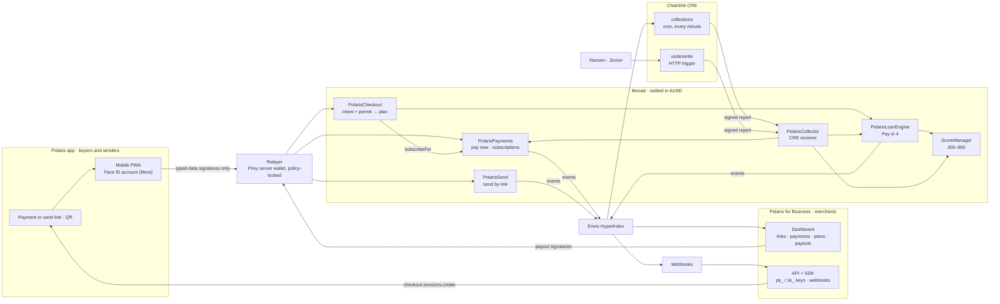

# Polaris on Monad: the Metropolis plan

> **Stripe for every app on Monad.** One link to get paid now, later, or every
> month. The buyer opens it, creates an account with Face ID, and pays in
> dollars. No wallet, no gas, no seed phrase, no email code. The merchant is
> paid in full, in AUSD, in under a second, and withdraws the same minute.

| | |
|---|---|
| Hackathon | Monad **Metropolis**. Online, 1 Sep – **13 Oct 2026, 11:59 PM ET** (hard cutoff; late entries refused) |
| Track | **02 · Consumer Products & Payments**. $30,000, split evenly between 3 winning teams |
| Also in play | **Overall winner**. $25,000, picked across all four tracks |
| Primary bounties | **Agora**, cross-border payments ($10,000) · **Privy** ($5,000) · **Chainlink**, CRE ($3,000) |
| Stack-ons (our design already meets them) | **Nansen** ($5,000 pool) · **Mera UX** ($2,500) · **Envio** ($1,000) |
| Time left | **17 days** from Sat 26 Sep. We submit **Mon 12 Oct**, a day early |
| Repo | A **new public repo**. The first commit imports only the reused foundation; everything after it is new (§1.3) |

---

## 1. What the hackathon rewards

### 1.1 Track 02 and the judging

- **Track 02 is about consumer financial products that use on-chain rails as a
  design advantage, for people who don't think of themselves as crypto users.**
  Its framing stresses "a user's first five minutes", so every decision below is
  tested against that.
- **The track's three example ideas:** a payments app that never mentions a
  blockchain; subscriptions charged by the second; and shared wallets or group
  spending without an intermediary. We ship the first, already have
  subscriptions, and keep the other two as stretch goals (§6).
- **Track judging** gives 20% each to five criteria:

| Criterion (20% each) | What we put in front of the judges |
|---|---|
| Product quality and completeness | Two finished apps, a real phone, no dead ends (§8) |
| Technical excellence | Contracts with exploit-named tests, gasless signatures, CRE orchestration |
| Monad integration | Sub-second settlement timed on screen, the cost per collection, AUSD native, Mera |
| Track fit and problem relevance | A buyer who never sees crypto words; cross-border merchants paid instantly |
| Innovation and impact | Credit built into checkout, underwritten from wallet history by a DON |

- **Sponsor bounty judging** is weighted 40% on meeting the published
  requirements, 30% technical implementation, 20% Monad integration and 10%
  innovation. **Meeting the letter of each bounty is the biggest single lever**,
  which is why §3 lists every requirement and exactly where we meet it.
- **Stacking is official.** The portal says to pick one track, then add as many
  sponsor bounties as you like. Limits: one project per participant, one track,
  and at most one main-track prize.
- **Timeline:** judging runs 14–27 Oct and winners are announced 3 Nov. The
  judges include VC partners (Paradigm, Electric Capital, Galaxy), so the
  write-up has to read like a company, not a demo.

### 1.2 Mandatory for every submission (from the official rules)

1. **Public GitHub repo** with the complete source, a README with setup
   instructions, an open-source licence (MIT), clear attribution of external
   code and libraries, and **a commit history covering the build window**.
2. **Demo video, 3 minutes,** public (YouTube, Loom or Vimeo). It must show the
   product working and its Monad integration.
3. **Monad integration:** an explanation of how we use Monad, the contract
   addresses, and a deployment on mainnet or testnet.
4. **Originality:**
   - **The substantial majority of the submitted work must be created during
     the hackathon.**
   - Pre-existing code may be the foundation only if the README identifies it
     and the submission adds substantial new functionality.
5. **AI coding tools are allowed but must be disclosed in the README.** We use
   Claude Code, so say so.
6. **Documentation:** description, architecture overview, tech stack, and setup
   and deployment steps.
7. **Per-bounty fields.** Each bounty lists what it needs, and we fill those
   fields in when we submit.

### 1.3 What that means for the repo

This monorepo is mostly pre-August code: a Solana program, two Expo apps,
landing pages and more. **Submitting it as-is would fail the originality rule.**
So:

- **Create a new public repo, `polaris`.** Commit one is *"Import pre-existing
  foundation from polaris-solana@daca8ca"* and brings over **only** what we
  reuse (§4), unchanged.
- **The README's "Pre-existing components" table** lists exactly those paths.
  The write-up shows the `git diff --stat` from that commit to `HEAD` as the
  evidence of new work.
- **Everything else is new, and committed in small steps from today.** Don't
  squash, because the commit history is a requirement.
- Link `polaris-solana` from the README as prior work. It stays untouched.

---

## 2. Positioning

### The pitch

Say it in this order, every time: in the video, the write-up and the profile.

1. **Every app that sells something needs Stripe.** On Monad, apps still ask a
   buyer to install a wallet, hold gas and pay in full, and merchants wait for
   money they then can't easily move.
2. **Polaris is Stripe for every app on Monad.** A merchant shares one link. The
   buyer creates an account with Face ID and pays **in full**, **in four
   instalments** against a credit line read from their on-chain history, or **on
   a subscription**. They can also **send dollars across borders by link**.
3. **The merchant is paid in full, up front, in under a second,** in AUSD, and
   withdraws the same minute. Credit risk and collections are ours, not theirs.

**One-liner for the profile:** *Payment links with credit built in: Stripe for
every app on Monad.*

### Two sides, one network

| Side | For | Signs in with | Does |
|---|---|---|---|
| **Polaris** (mobile app) | Buyers and senders | **Face ID passkey (Mera)**. No email, no seed phrase, no extension | Pays links in full or in 4, runs subscriptions, sends dollars across borders by link, shows the credit line and why |
| **Polaris for Business** (web) | Merchants and platforms | **Privy** (email or Google) plus an embedded payout wallet | Links, the checkout API and SDK, the dashboard, payouts and webhooks |

Consumers get Face ID because the first five minutes are the product. Merchants
get Privy because a business needs team logins, recovery and server-side
automation.

### The Stripe map, and where each piece stands today

| Stripe | Polaris on Monad | State today |
|---|---|---|
| Payment Links | `pay.polarispay.app/<id>`: link + QR | Bills API exists; **the hosted page was never built** |
| Checkout | Pay now · Pay in 4 · Subscribe, inside the Polaris app | **Build** (§5.6) |
| Link (Stripe's consumer wallet) | The Polaris app: a Face ID dollar account | **Build** (§5.6) |
| Klarna / Affirm | Pay in 4; the merchant is paid from the pool | `PolarisLoanEngine`: live on Sepolia, tested |
| Billing | Subscriptions; missed periods skipped, not stacked | `PolarisPayments`: tested |
| Radar | Underwriting from wallet history plus a sybil check | `packages/underwriting`: EVM, tested |
| Connect payouts | One-tap and automatic payouts, batch payouts with memos | `BatchSettlement` exists; payouts to build |
| API keys + webhooks | `pk_`/`sk_` keys, HMAC-signed webhooks with retries | `packages/db`: signing, retries, key hashing |
| Terminal | Android POS with a receipt printer | `merchant-app` (Solana, stretch only) |

**Most of the hard, risky part is already built and tested:** the credit engine
and its exploit fixes. The hackathon goes into what judges touch: the two apps,
gasless signing, the credit engine on CRE, and payouts.

### Why this wins Track 02

- **No blockchain in sight.** Face ID creates the account, prices are in
  dollars, there's one *Confirm*, and the buyer never holds MON (§5.3).
- **The first five minutes, timed.** The video shows a clock: link to paid in
  under a minute (§8).
- **Subscriptions** are already built. Per-second metering is a stretch that
  hits the track's second example idea head on.
- **Overall-winner angle.** Our credit engine is also *exactly* Track 01's
  example idea (undercollateralized lending from on-chain credit history). One
  product spans two tracks' theses.

### Why Monad (it's 20% of every score, so be concrete)

- **BNPL is lots of small writes.** A four-instalment plan is one origination,
  four collections and a stream of notifications. That only pays for itself
  where each write is cheap and final. Monad makes a block every 400 ms and
  finalises in 800 ms.
- **Checkout and remittance need instant finality.** "Paid" and "Arrived"
  appear before the page could reload. There is no pending state.
- **EVM-equivalent.** Our hardened Solidity deploys unchanged, so we build
  product instead of porting.
- **Dollars are native.** AUSD and Circle USDC both live on Monad, and both take
  signature-based approvals (ERC-2612 / ERC-3009). That gives a gasless
  checkout without account abstraction.
- **Passkey accounts are a Monad-native path.** Monad's own docs ship Mera,
  which turns Face ID into a normal account with nothing to deploy.

### Why now

Stripe bought Bridge (stablecoin orchestration, $1.1B, Feb 2025) and then Privy
(embedded wallets, June 2025). The biggest payments company in the world is
betting that wallets plus stablecoins become payment rails. Polaris is that bet,
native to Monad, with **credit built into checkout** instead of bolted on
through a third-party BNPL provider. And our merchant side runs on Privy,
Stripe's own wallet stack.

### Words the buyer never sees

| Never | Instead |
|---|---|
| wallet, address, seed phrase, passkey | account, Face ID |
| sign, approve, transaction | confirm |
| gas, MON | nothing (we pay it) |
| AUSD, USDC, token | $, dollars |
| blockchain, on-chain, Monad | nothing on the buyer's path. "View receipt" opens the explorer |

Two exceptions:

- The optional *Bring your history* step (§5.5) says "wallet", because it
  exists for people who already have one.
- Home's balance card carries a small "USD · AUSD" tag: it names what the
  dollars are held in, once, for the Agora track. Nowhere else says AUSD.

Lists say "activity", never "transactions": Home's "Recent activity",
Activity's "All activity", and a row's sheet is "Payment details".

Run a copy pass against this table before the freeze.

### Numbers for the pitch (check each against the deployed contracts before recording)

- **Merchant fee 0.5%** on direct payments (`PolarisPayments.feeBps = 50`),
  against roughly 3% for cards plus days-long payouts.
- **Pay in 4:** the merchant gets 100% at origination. The buyer pays 10% APR,
  pro-rated: **$200 becomes 4 × $50.38**, which is $1.53 in total interest,
  shown before they confirm. That's the example the landing page already uses.
- **Settlement in under a second**, against T+2 days or more.

---

## 3. Sponsor strategy

The requirement lines below are paraphrased from copies of the portal's bounty
page. Three teams posted matching copies. **Confirm each one when logged in on
Day 0.**

| Bounty | Amount · track | Requirement (paraphrased) | Where we meet it |
|---|---|---|---|
| **Agora**: Cross-Border Payments | $10,000 · Track 02 only | A **mobile app** where users **send AUSD across borders**, with **Mera passkey onboarding** and **instant settlement** | The Polaris app: Face ID onboarding (Mera), send-by-link and pay-by-link in AUSD, final in 0.8 s |
| **Privy** | $5,000 · all tracks | Use Privy **beyond authentication**; login-only doesn't qualify | Merchant embedded payout wallets, **policy-locked server wallets that relay every payment**, automatic payouts |
| **Chainlink**: CRE | $3,000 · all tracks | Build, **simulate** or deploy a CRE workflow used as an **orchestration layer** | Collections (cron) and underwriting (HTTP) workflows orchestrate the credit engine |
| **Nansen** | $5,000 pool · all tracks | A product experience powered by Nansen data, API, MCP or CLI that goes **beyond exposing raw data** | The credit line: Nansen Profiler facts become an on-chain score with plain-language reasons |
| **Mera UX** | $2,500 · all tracks | Mera is the **entire account layer**: no seed phrase, no extension, no custody backend | The consumer app. It's uncertain whether Privy on the merchant side conflicts (§10) |
| **Envio** | $1,000 · all tracks | HyperIndex, HyperSync or HyperRPC powering real on-chain data behind a **core feature** | The dashboard, webhooks and the CRE candidate list all read from one HyperIndex indexer |

**Ceiling:**

- Track 02: $10,000
- Overall winner: $25,000
- Primary bounties: $18,000
- Stack-ons: $8,500 (Nansen's $5,000 is a pool and may be split)

That comes to **about $61,500**. Stretch bounties add $7,500 (§3.5).

**Every sponsor is load-bearing.** Remove any one and a core flow breaks. The
write-up must say, for each bounty, which requirement is met where, because
meeting the requirements is 40% of the bounty score.

### 3.1 Agora (AUSD): the consumer app and the money

- **Mobile app:** the Polaris app is a mobile-first, installable PWA. That's
  one codebase with the hosted checkout, and passkeys work in it on iOS 18+ and
  Android Chrome.
  - **Ask Agora on Day 0 whether a PWA counts as a "mobile app".**
  - If it doesn't, wrap it as an Android Trusted Web Activity APK (a day's
    work). Porting the Expo app with Mera's React Native guide is the last
    resort.
- **Send AUSD across borders, by link.** The sender types an amount, gets a link
  and shares it on WhatsApp. The recipient abroad opens it, creates an account
  with Face ID and the dollars are theirs, final in 0.8 s. Claim links are
  front-run-proof (§5.2), and the same flow sends to existing users by QR.
- **Pay across borders, by link.** A merchant's payment link is the same
  mechanism pointed at a business.
- **Mera onboarding is the only way into the consumer app.**
- **AUSD everywhere:** balances, payments, the BNPL pool, credit limits and
  payouts. AUSD implements ERC-2612 and ERC-3009, so every consumer action is a
  signature (§5.3).
- **Local currency next to dollars** (display only), on screens and receipts.
- **Demo story:**
  1. A studio in Buenos Aires invoices a client in Berlin.
  2. The client pays in 4.
  3. The studio pays a freelancer in Manila by link.
- **Stretch:** park the idle BNPL pool in earnAUSD (Agora × Upshift) so capital
  earns between loans.

### 3.2 Privy: the business side and every transaction's carrier

1. **Merchant sign-up and team login** (email or Google). This is the part that
   doesn't count on its own; everything below does.
2. **Embedded payout wallets.** Every merchant gets a self-custodial wallet on
   day one. Withdrawals are ERC-3009 signatures from that wallet, sent by the
   relayer, so merchants never hold MON either.
3. **Server wallets with policies carry every payment in the network.** The
   relayer is a Privy server wallet. Its policy allows only our contracts, only
   the functions in §5.3 and zero MON value. A compromised server can't send
   money anywhere a user didn't sign for. The protocol treasury is a server
   wallet too, with its own narrow policy.
4. **Automatic payouts, Stripe-style.** A merchant turns on daily payouts once.
   A Privy session signer (server-side signing for their wallet, check current
   Privy docs) sweeps the balance to their payout address, and a policy allows
   *only* that address.
5. **Narrative:** Privy is Stripe's wallet stack, and Polaris for Business is
   Stripe for every app on Monad.

Continuity: `merchant-web` and `shopping` already run `@privy-io/react-auth`.
Day 0: create the Privy app for Monad testnet (10143) and mainnet (143), and
email `monad@privy.io` about the subsidised testnet programme listed in Monad's
docs.

### 3.3 Chainlink CRE: the BNPL engine

A BNPL product is only as good as its collections and its underwriting. Our EVM
build ran collections on KeeperHub, which **doesn't list Monad**. CRE replaces
it, and our design already has CRE's shape: check on chain, act on chain, never
act on a stale off-chain view. The code is in `workflows/` (TypeScript on
`@chainlink/cre-sdk` 1.22.0, CRE CLI v1.35.0); each workflow writes to its own
receiver in `packages/contracts/contracts/cre/`, all built on Chainlink's
`ReceiverTemplate`. `workflows/README.md` is the reference.

**Workflow 1: `polaris-collections`** (cron: every minute in simulation, daily
once deployed) → **`CollectionsReceiver`**

```
Envio: plans and subscriptions whose next attempt has come   (the indexer proposes;
       on the dunning ladder)                                  without it, the chain's
                                                               own counts, on the same ladder)
EVM read: CollectionsReceiver.checkTasks((action, id)[])      (the chain disposes: one read
          at the last finalized block                          per 72 tasks, CRE's 5 KB cap)
DON consensus → one signed report → forwarder → CollectionsReceiver._processReport
  per task: try collectInstallment / chargeDue / liquidate; catch → TaskSkipped(reason)
receipt read back → skip reasons (allowance_lost | insufficient_funds | other)
            → signed callback to our API → dunning ladder (6h → 24h → 72h → 168h → liquidation)
            → webhook to the merchant, notification to the buyer
```

`checkTasks` is a purpose-built view rather than Multicall3: CRE caps a read at
5 KB, which fits about 20 Multicall3 checks and about 150 ids here. Every action
is permissionless on its target, so the receiver adds no power, and there is
no fallback keeper: if CRE is down, anyone can call the same functions
(`workflows/README.md`).

**Workflow 2: `polaris-underwrite`** (HTTP trigger, fired when a buyer asks to
raise their limit) → **`UnderwritingReceiver`** → `ScoreManager.underwrite`

The workflow first checks the account's own signed consent and any history
wallet's proof, then everything the chain would refuse (already underwritten, a
history already lent to another account), all before a paid call. Then it
fetches facts about the buyer's account and any history wallet they linked
(§5.5):

- **Nansen:** first funder, counterparties, related wallets (a sybil signal),
  PnL
- **Zerion:** wallet age, transactions and holdings, including Monad testnet
- **Etherscan and public RPCs:** prior liquidations on allowlisted Aave pools,
  send counts

The paid calls go through CRE's **Confidential HTTP** (a config switch, on in
simulation): each is made once, from an enclave that resolves the API key from
the Vault DON, so no node holds a key. With it off, every node calls the
providers and the DON agrees field by field (counts by median, verdicts by
identical). The report carries facts; `ScoreManager.underwrite(user, facts)`
computes the score **on chain**.

**No single key can hand out credit.** The DON attests facts, never a score.
The contract does the arithmetic, the opening line is capped at $1,000, and
$2,500 and $5,000 are reached only by repaying.

**Workflow 3: `polaris-guardian`** (cron) → **`GuardianReceiver`**. It reads
Chainlink's AUSD/USD feed on **Monad mainnet** from inside the testnet
workflow, plus the pool's own numbers, and pauses only new Pay in 4 plans
(`PolarisCheckout.openPlan`) when AUSD trades below $0.995, free pool cash
falls under $1,000, bad debt passes 5% of what buyers owe, or the price is
more than 2 h old. It resumes on the next healthy report. Pay now, Send and
Subscribe never stop. The CRE project has a read-only `monad-mainnet` RPC
(`https://rpc.monad.xyz`) in every target for this; nothing writes to mainnet.
Its status is in `workflows/README.md`.

- **Simulation qualifies:** the bounty says build, simulate *or* deploy.
  `cre workflow simulate --broadcast` sends real transactions to Monad testnet
  through the simulation forwarder, and `pnpm --filter @polaris/cre-workflows
  evidence` records each run's log and hashes.
- **Deploy access, requested on Day 0** (`cre account access`; `cre whoami`
  shows it once granted): `cre workflow deploy` needs it, simulation doesn't. A
  deployed workflow is a stronger entry.
- **Monad is supported:** forwarders exist for testnet and mainnet (Appendix A).
- **Three workflows fit** the private registry's limit of three per
  organisation.

### 3.4 Stack-ons: small extra work, real money

- **Nansen** ($5,000 pool): it's the underwriting brain (§3.3), and every credit
  reason shown in the app ("Funded from a major exchange · +10") traces to a
  Nansen fact. The write-up should say plainly that this is a credit decision,
  not a data table.
  - **Constraints:** Nansen covers Monad **mainnet only**, so score linked
    wallets' mainnet history; the testnet account itself goes through Zerion.
  - **Credits:** the free plan is 100 one-time credits plus 10 a day, and the
    labels endpoint costs 100 credits. Cache per wallet, skip labels, and ask
    Nansen for hackathon credits or pay per call over x402.
  - The portal lists Nansen's CEO among the main-track judges.
- **Mera UX** ($2,500): the consumer account layer is entirely Mera: no seed
  phrase, no extension, no custody backend. The relayer holds only its own MON
  for gas, never user funds. **Ask on Day 0 whether Privy on the merchant side
  disqualifies us.** It isn't counted as certain.
- **Envio** ($1,000, plus hosting for winners): we need an indexer anyway.
  - HyperSync serves Monad testnet (`monad-testnet.hypersync.xyz`) and mainnet,
    and `pnpx envio init` generates the indexer from our ABIs.
  - Local runs need Docker, which means WSL on Windows.
  - The free cloud plan deletes deployments after 30 days, so **deploy on or
    after 5 Oct** so it's still up on 3 Nov.

### 3.5 Stretch bounties (only after every MUST in §6 is done)

- **Aurora Intents** ($5,000): *Top up from any chain* and *Cash out to any
  chain*. A buyer funds from USDC on Base, Arbitrum or Solana; a merchant cashes
  out to a chain where off-ramps are plentiful.
  - It's **mainnet only**, and its Monad token list shows USDC, not AUSD.
  - So it needs a capped mainnet deployment (§6 item 22) and real small funds.
  - Deposit addresses come from `POST https://intents-api.aurora.dev/api/quote/{appKey}`.
- **Mera: One Passkey, Many Keys** ($2,500): *receipts only you can read.* The
  same Face ID passkey derives a separate encryption key. Purchase history and
  receipts are stored encrypted with it, so our servers hold ciphertext and the
  history follows the passkey to every device. Unlike Klarna, we *can't* read
  what you bought.

### 3.6 Not targeting, on purpose

- **Dynamic** ($5,000): a second auth and wallet stack next to Privy is worse
  for users and splits focus.
- **Cleanverse** ($2,000): Track 04 only.
- **Mercuryo** (winners' perk, not a bounty): on Monad it supports only MON,
  pays out to cards in EUR or USD only, and needs user KYC. It can't cash out
  AUSD or USDC on Monad.
- **Alchemy** ($1,000 in credits): our gasless path doesn't need it.
- **Kuru, Perpl, Agora mobile trading, MetaMask plugin, AI model credits:**
  different products.
- **Best Community Team Project** ($5,000): depends on whether the team counts
  as a community supporter team. Ask (§12).

---

## 4. The foundation we import, and what stays behind

**Imported in commit one, unchanged, and listed in the README as pre-existing:**

| Piece | From | Why it's worth keeping |
|---|---|---|
| Contracts: LoanEngine, Payments, ScoreManager, CollateralVault, MerchantRegistry, BatchSettlement, plus their tests | `packages/contracts` | Live on Sepolia. Regression tests for every exploit found (dust immunity, free self-liquidation, fee on the wrong base) |
| Underwriting signals | `packages/underwriting` | EVM-generic, 7 signals including the sybil check, tested |
| Dunning ladder and failure taxonomy | `packages/keeperhub/src/dunning.ts` | Treats "short on funds", "allowance lost" and operator errors differently; never duns a buyer for our mistake |
| Webhook signing and API-key hashing | `packages/db/src/webhooks.ts` and helpers | Stripe-shaped signatures, 300 s replay window, retries with backoff |
| `polarispay-sdk` | `packages/sdk` | npm 0.2.0. Takes any EIP-1193 provider |
| Score explanations | `apps/gateway/src/score.ts` (`explain()`) | "Wallet first used 2 years ago · +48" |

**Not imported: reference only, linked as prior work.** That's the Solana
program, keeper, gateway and SDK; the Expo shopper app; the merchant terminal;
`merchant-web`, `apps/core` and `apps/merchant` (the new dashboard is built
fresh, borrowing ideas, not files); `landing`, `packages/protocol`,
`packages/mcp` and `keeper/`. If we copy a specific file, it goes in the
README's pre-existing table.

**Known bugs in the old merchant platform. Don't port them:**

| Bug | Where it lived | Do instead |
|---|---|---|
| Client secret stored in plain text and matched with `findOne` | `merchant-web/app/api/apps` | Hash keys, using the `packages/db` helper |
| Server trusted an `x-wallet-address` header; CORS was `*` | merchant-web API | Verify the Privy access token server-side |
| Webhook routes had no ownership check | merchant-web | Scope them to the authenticated merchant |
| `bills/pay` marked a bill paid from a caller-supplied hash | merchant-web | Paid only from indexed chain events |
| Secret key shipped to the browser | `merchant-web/components/sdk` | Publishable key plus a server-created session |
| Webhook secrets from `Math.random` | merchant-web | `crypto.randomBytes` |
| 18 decimals assumed for a 6-decimal token | `PayWithPolaris` | Read decimals from the token |
| Unauthenticated `seed-demo` handed out credentials | merchant-web | Don't build it |
| Alchemy RPC key hardcoded | `merchant-web/lib/constants.ts`, `shopping` | Env vars, **and rotate the leaked key now** |

**Other traps:**

- `packages/protocol` gives Monad testnet chain ID **20143**. The real ID is
  **10143**.
- `docs/DEPLOYMENT.md` lists *legacy* Sepolia addresses.
- `docs/FEATURES.md` says 57 features shipped in one place and 85 in another.
  Quote neither without checking.

---

## 5. What we build: all new in the window

### 5.1 Architecture



### 5.2 Contracts

1. **Monad networks** in the Hardhat config: `monadTestnet` (10143) and `monad`
   (143). Verify every deployment on MonadVision or Monadscan.
2. **`PolarisPayments.payWithAuthorization`.** Uses ERC-3009
   `receiveWithAuthorization`, with the nonce derived from
   `keccak256(merchant, orderId)` instead of taken from the caller. The buyer's
   signature therefore commits to this merchant and order, and the relayer
   can't redirect the money. A replay fails at the token, and the existing
   `DuplicatePayment` guard still stops a second payment for the same order.
3. **`PolarisCheckout`** (new; the only originator).
   - **Pay in 4:** it verifies the buyer's EIP-712 `PlanIntent` (merchant,
     amount, instalments, interval, orderId, deadline, nonce) and consumes an
     ERC-2612 permit sized to everything the buyer owes, because one allowance
     backs the whole book. Then it calls `createLoan`. Opening a plan becomes
     one transaction that the buyer consented to by signature. That's the
     Solana build's best improvement, ported back to EVM.
   - **Subscriptions:** `subscribe` verifies a signed `SubscribeIntent` plus a
     permit, then calls a new checkout-only `PolarisPayments.subscribeFor`.
     Today's `subscribe()` takes the subscriber from `msg.sender`, so it can't
     be relayed.
4. **`PolarisSend`** (new): send by link.
   - The link carries a throwaway private key in its URL fragment, which never
     reaches our server. `send` escrows AUSD against that key's address; the
     sender's ERC-3009 authorization pulls the funds.
   - `claim(to, sig)` needs the throwaway key's signature over the recipient's
     address. Watching the transaction can't redirect the funds, and a link
     pays out once.
   - The sender can cancel before it's claimed. After expiry, anyone can return
     the funds, but only to the sender.
5. **`collectInstallment(loanId)`**: permissionless, takes no amount and
   collects exactly what's due. Arbitrary `repay` amounts need the borrower.
   This ports the second Solana-era fix back: a stranger can no longer drain a
   standing allowance early.
6. **`ScoreManager.underwrite(user, facts)`**: writer-only (the CRE receiver).
   - It refuses anyone who already has a record, and evidence older than 15
     minutes.
   - It computes the score on chain and caps the opening line at $1,000.
   - A test asserts that the TypeScript mirror and the contract agree, as the
     Solana suite already does.
7. **Minimum interval per deployment,** like `gracePeriod`: 1 hour in
   production, 60 s for the demo deployment, so a whole plan plays out on
   camera. The same applies to the subscription period minimum.
8. **`PolarisCollector`** (new): a CRE `ReceiverTemplate` consumer.
   - It accepts reports only from the KeystoneForwarder and our workflows.
   - It runs collections, charges and liquidations in a batch, each in its own
     try/catch.
   - It forwards underwriting reports to `ScoreManager`.
9. **`MerchantRegistry.registerFor`** (owner-only), so a merchant is onboarded
   without holding MON.
10. **Tests named for the exploit,** as the suite already does:
    - a relayer can't open a plan the buyer didn't sign
    - a relayer can't redirect a payment to another merchant
    - a replayed permit can't open a second plan
    - a watched claim can't be redirected
    - a link can't be claimed twice
    - an expired link refunds only to the sender
    - a stranger can't collect more than is due
    - a stale underwriting report is refused
    - a second `underwrite` can't reset a bad record
    - a forged report is refused by the receiver

### 5.3 Gasless by construction

| Action | Who signs (no gas) | The relayer calls |
|---|---|---|
| Pay now | Buyer (Mera): `ReceiveWithAuthorization` | `PolarisPayments.payWithAuthorization` |
| Pay in 4 | Buyer: `PlanIntent` + `Permit` (one *Confirm*, two signatures) | `PolarisCheckout.openPlan` |
| Subscribe | Buyer: `SubscribeIntent` + `Permit` for a year of periods | `PolarisCheckout.subscribe` |
| Send by link | Sender: `ReceiveWithAuthorization` | `PolarisSend.send` |
| Claim | The link's throwaway key, over the recipient's address | `PolarisSend.claim` |
| Send to a user, withdraw, payout | Owner: `TransferWithAuthorization` | AUSD `transferWithAuthorization` |

- **Consumers sign with Mera's viem account** (`toViemAccount`). Merchants sign
  with their Privy embedded wallet.
- **The relayer is a Privy server wallet whose policy allows only the calls in
  this table, with `value == 0`.** Every call carries its owner's signature, so
  the relayer can carry money but can't move it anywhere the owner didn't sign
  for.
- **The policy is one `ALLOW` rule per call.** Here is a sketch of one; check
  the field names against Privy's docs, and confirm that unmatched requests are
  denied:

  ```json
  {
    "version": "1.0",
    "name": "polaris-relayer",
    "chain_type": "ethereum",
    "rules": [
      {
        "name": "Open plans through PolarisCheckout, never send MON",
        "method": "eth_sendTransaction",
        "conditions": [
          { "field_source": "ethereum_transaction", "field": "to", "operator": "eq", "value": "<PolarisCheckout>" },
          { "field_source": "ethereum_transaction", "field": "value", "operator": "eq", "value": "0" },
          { "field_source": "ethereum_calldata", "field": "function_name", "abi": "<PolarisCheckout ABI>", "operator": "eq", "value": "openPlan" }
        ],
        "action": "ALLOW"
      }
    ]
  }
  ```

- **Monad charges gas on the gas *limit*, not on gas used.** Every sender (the
  relayer and CRE) sets its limit from `eth_estimateGas`
  plus about 15%, never a blanket 1M.
- **No dependency on EIP-7702 or ERC-4337.** Mera accounts are plain EOAs, and
  Monad adds reserve-balance rules for 7702-delegated accounts that we'd rather
  not design around.

### 5.4 The credit engine on CRE

- **Workflows:** `workflows/collections/` and `workflows/underwriting/`, in
  TypeScript on `@chainlink/cre-sdk` (cron and HTTP triggers, the EVM client,
  the HTTP client and Confidential HTTP). The receivers are
  `CollectionsReceiver` and `UnderwritingReceiver` (§3.3).
- **Dunning:** CRE skip reasons drive the dunning ladder. It distinguishes
  "short on funds" from "allowance lost", and it never duns a buyer for our
  mistake. The indexer, the workflow and the webhooks use the same words
  (`insufficient_funds`, `allowance_lost`, `other`).
- **No fallback keeper.** Every collection action is permissionless on chain,
  so if CRE is down anyone can call `collectInstallment`, `chargeDue` or
  `liquidate` directly (`workflows/README.md`).

### 5.5 Cold-start credit

- **A new Face ID account has no history.** At the $200 floor, a $200 purchase
  plus interest doesn't fit, so cold start is a product problem, not an edge
  case.
- **Bring your history** (optional): *"Raise your limit: confirm with the
  wallet you already use."* One signature from that wallet over WalletConnect,
  not an extension, proves ownership. The `underwrite` workflow verifies it and
  scores that wallet with Nansen and Zerion.
- **Limits:** the opening line runs from a $200 floor to a $1,000 cap. Higher
  tiers come only from repaying: +12 on time, −40 late, −150 on default.
- **No history at all:** lock AUSD in `CollateralVault` and get 150% of it as
  extra limit. That's the secured-card path.
- **Every limit explains itself** with the imported `explain()` lines plus
  Nansen-backed reasons.

### 5.6 The Polaris app: PWA, Mera, checkout

> **Visual design:** the app follows [`docs/design/mobile.md`](design/mobile.md)
> and its reference image exactly. It supersedes the old Polaris brand for the
> consumer app.

- **One Next.js PWA serves `app.` and `pay.polarispay.app`.** Checkout works
  without installing anything, and *Add to Home Screen* comes after the first
  payment.
- **Mera setup:**
  - `@category-labs/mera`: `createPasskeyWithPrfOutput` to create an account,
    `getPasskeyPrfOutput` to sign back in, then
    `createSecp256k1SigningSession` → `toViemAccount`.
  - **Pick the rpId once: `polarispay.app`.** A passkey is tied to it. Change
    the domain later and accounts can only be recovered from the exported
    mnemonic.
  - The same passkey syncs through iCloud Keychain and Google Password Manager,
    so the same account appears on every device the buyer owns.
- **Screens:**
  - **Home:** balance in $ and local currency; credit line and next payment
  - **Pay:** scan or open a link; Pay now, Pay in 4 or Subscribe; receipt;
    redirect to `successUrl` plus `postMessage` to the opener (which finally
    completes the `shopping/` demo)
  - **Send:** amount, then a link to share; a claim screen for the recipient
  - **Plans:** schedules, *Pay early*, subscriptions, *Cancel*
  - **Activity:** receipts, with *View receipt* opening the explorer
- **Supported devices:** iOS 18+ (Safari or Chrome, iCloud Keychain), Android
  Chrome or Edge (Google Password Manager), macOS 15+, and Windows 11 25H2+.
  **Not supported:** desktop Chrome's local profile, Bitwarden and Dashlane.
  Unsupported browsers get a QR code: *"Open on your phone."*
- **"Paid" only ever comes from indexed chain events,** never from the client.

### 5.7 Polaris for Business: Privy, links, payouts

- **Onboarding on one screen:** Privy login, business name, done. The embedded
  payout wallet exists immediately, and `registerFor` registers the merchant
  server-side. On testnet we activate with a low cap.
- **Home:** balance, payments, the Pay in 4 ledger (collecting, dunning or
  closed, with instalment tick marks) and at-risk exposure.
- **Links:** create, share and show a QR. Amount, description, modes, single-use
  or reusable, and an expiry.
- **Payouts, the "easy withdraw":**
  1. One tap to any address or exchange deposit address, gasless (§5.3).
  2. Automatic daily payouts through a Privy session signer, with a policy that
     allows only the merchant's payout address.
  3. Batch payouts with memos for platforms paying many sellers
     (`BatchSettlement`).
  4. Stretch: cash out to another chain through Aurora (§3.5).
  - **Bank payouts are out of scope for the hackathon:** Mercuryo can't pay out
    AUSD or USDC on Monad. Say so under *What's next*.
- **Developers:** API keys, webhook endpoints, a test-event button and a
  delivery log.

### 5.8 The developer surface, with Stripe's ergonomics

```ts
// Server: create a checkout session, redirect the buyer
const session = await polaris.checkout.sessions.create(
  {
    amount: "200.00",
    description: "Brand identity package",
    modes: ["now", "later"],
    successUrl: "https://studio.example/thanks",
  },
  { idempotencyKey: order.id },
);
redirect(session.url);
```

```ts
// Webhook receiver
const event = polaris.webhooks.verify(rawBody, req.headers["polaris-signature"], secret);
if (event.type === "payment.succeeded") fulfil(event.data.orderId);
```

- **Events:** `payment.succeeded`, `plan.opened`, `installment.collected`,
  `installment.failed`, `plan.completed`, `plan.liquidated`,
  `subscription.charged`, `subscription.canceled`, `payout.paid`.
- **SDK:** publish `polarispay-sdk@0.3.0` with `MONAD_TESTNET` and `MONAD`
  presets.
- **Docs page:** a ten-line integration, webhook verification and a test-mode
  walkthrough.

---

## 6. Scope

**MUST: the demo or the submission breaks without these**

1. The new repo: a foundation-import commit, a README with the pre-existing
   table, the AI-tools disclosure and attribution, and an MIT licence
2. Contracts on Monad testnet with AUSD: §5.2 items 1–5 and 7–9, with tests
3. The Polaris app: Face ID onboarding (Mera), balance, pay a link now, **send
   by link and claim**, all gasless
4. Pay in 4 end to end in the app
5. The relayer on a Privy server wallet with its policy
6. Polaris for Business: Privy login, embedded payout wallet, links, payments,
   one-tap withdraw
7. CRE `collections` running against Monad testnet (deployed, or simulated with
   `--broadcast`)
8. Demo video, write-up, profile and every per-bounty field

**SHOULD**

9. CRE `underwrite` + `ScoreManager.underwrite` + Nansen and Zerion facts +
   *Bring your history*
10. Envio HyperIndex behind the dashboard, webhooks and CRE candidates (fallback:
    viem `getLogs`)
11. Webhooks, `pk_`/`sk_` keys, SDK 0.3.0 and the docs page
12. Automatic payouts through a Privy session signer
13. Subscriptions in the app
14. The `shopping/` storefront wired end to end

**COULD: stretch, in this order**

15. Receipts only you can read (Mera *Many Keys*)
16. Top up and cash out from any chain (Aurora; needs item 22)
17. Per-second subscriptions (Track 02's second example idea)
18. Split-the-bill links (Track 02's third example idea)
19. Platform fees, Connect-style: an app that embeds Polaris takes a cut
20. An Android TWA build, if Agora says a PWA isn't enough (then it's a MUST)
21. earnAUSD yield on the idle pool
22. A mainnet deployment of **Pay now and Send only**, capped. No credit risk,
    real money

**WON'T, this hackathon:** the Expo port (unless Agora demands native), the
POS terminal, any Solana changes, a Shopify plugin, and credit on mainnet with
real money (unaudited).

---

## 7. Schedule (Sat 26 Sep → Tue 13 Oct, 11:59 PM ET)

Four roles, mapped to whoever is on the team.

- **A:** contracts + CRE
- **B:** the Polaris app (Mera)
- **C:** Polaris for Business + relayer + API (Privy)
- **D:** data and story (Envio, Nansen and Zerion, demo, write-up)

With fewer people, D folds into A and C.

| Dates | A · Contracts + CRE | B · App (Mera) | C · Business + relayer (Privy) | D · Data + story | Exit criteria |
|---|---|---|---|---|---|
| **Sat 26 – Sun 27 Sep** | New repo + import commit. Monad networks. Deploy the six contracts with AUSD; suite green | Mera smoke test on every team phone: Face ID → address → sign typed data | Privy app, a server wallet, and a policy that rejects a disallowed call | Envio init on Monad testnet. Nansen and Zerion keys. Day-0 questions (§11) | `pay()` from a script lands on Monad testnet, verified on the explorer |
| **Mon 28 Sep – Thu 1 Oct** | `payWithAuthorization`, `PolarisSend`, `PolarisCheckout`, `collectInstallment`, `registerFor`, minimum intervals, tests | Onboarding, balance, pay a link now, send and claim | Relayer service; Business login, links, payments list | Indexer schema for payments and sends; storyboard for the video | **Face ID → paid a merchant link, and a send link claimed on a second phone. Gasless, on testnet** |
| **Fri 2 – Mon 5 Oct** | `PolarisCollector` + `collections`; `underwrite` + `ScoreManager.underwrite` | Pay in 4 with the limit and its *why*; Bring your history | Payouts (one tap); webhooks, keys, event log | Nansen and Zerion adapters for `underwrite`; Envio to the cloud (on or after 5 Oct) | **An instalment collected by CRE on Monad testnet; the webhook arrives** |
| **Tue 6 – Thu 8 Oct** | CRE deploy if access has landed; mainnet decision | Subscriptions, copy pass, install polish (manifest, icons); TWA if needed | Automatic payouts; SDK 0.3.0 + docs; `shopping/` wired | README draft, write-up draft, per-bounty evidence | **The full 3-minute demo runs, uncut, on a real phone** |
| **Fri 9 Oct** | **Feature freeze at 18:00.** Bug bash on an iPhone and an Android phone | | | | Zero known bugs on the demo path |
| **Sat 10 – Sun 11 Oct** | D leads: video, README (pre-existing table, AI disclosure, attribution, setup), write-up, profile. Everyone reviews | | | | Someone who didn't build it can follow the README |
| **Mon 12 Oct** | **Submit** | | | | Confirmed on the portal |
| **Tue 13 Oct** | Deadline, 11:59 PM ET. Buffer only | | | | |

---

## 8. Demo (three minutes)

Record on real phones, in one take per scene, with a clock on screen.

| Time | Scene |
|---|---|
| **0:00–0:10** | *Invoice for the logo work: $200*, and a link, arrives in a chat. A studio in Buenos Aires is billing a client in Berlin |
| **0:10–1:00** | The link opens: **$200, or 4 × $50.38.** *Continue with Face ID*, and the account exists: no email, no password. The client picks Pay in 4, confirms with the wallet they already use to bring their history, and sees a **$500 limit with its why** (Nansen-backed). *Confirm* with Face ID shows **"Done. Studio Sol is paid. Your first payment of $50.38 is on Oct 4."** Nothing leaves their account today The clock reads under a minute |
| **1:00–1:20** | The studio's dashboard: **+$200.00**, paid in full, 0.8 s later. The plan shows 4 tick marks. Automatic payouts are on |
| **1:20–1:45** | The studio pays a freelancer in Manila: **$50 → a link → WhatsApp.** The freelancer opens it, taps Face ID, and it has **arrived**. Two countries, no bank, no fee to the recipient |
| **1:45–2:35** | For the judges. A second deployment runs 60-second instalments so a plan's whole life fits on camera; the buyer's plan above stays on weekly terms. Show, in order: the CRE log collecting instalment 2 on Monad; the explorer transaction; tick 2 of 4 filling in; the `installment.collected` webhook arriving; the Privy policy that locks the relayer; zero gas paid by any user; the Envio query behind the dashboard; tests named for exploits |
| **2:35–3:00** | For developers: ten lines of SDK, a session URL, a webhook. Close on **"Stripe for every app on Monad."** with the sponsor logos |

The recording is the submission; a live demo is only a bonus. If *Bring your
history* (§6 item 9) slips, record with a pre-scored demo account and say so in
the write-up.

---

## 9. Submission kit

- **Profile:** name, the one-liner, Track 02, and every bounty from §3.
- **Links:** the app, the Business dashboard, the repo, the video (public), and
  the contracts on the explorer.
- **README** (the rules check these):
  - description, architecture and tech stack
  - setup and deployment
  - contract addresses
  - **pre-existing components table**
  - **AI coding tools disclosure** (Claude Code)
  - attribution of external libraries
  - MIT licence
- **Write-up,** in this order:
  1. The problem
  2. The product
  3. The first five minutes
  4. How it works
  5. **What's new in Metropolis**, with the `git diff --stat` from the import
     commit
  6. **One heading per bounty:** each requirement, then where it's met, with
     code paths and transaction hashes
  7. What's next (bank payouts, mainnet credit after an audit)
- **Evidence for each bounty:**

| Bounty | Evidence |
|---|---|
| Agora | App URL (and the APK if we build one); AUSD addresses; a cross-border send and a claim on the explorer; timing of final settlement |
| Privy | App ID; the server-wallet policy JSON; the relayer's transactions; payout-wallet and automatic-payout code paths |
| Chainlink CRE | Workflow source paths; the DON deployment or `simulate --broadcast` logs (`workflows/evidence/`); `CollectionsReceiver` and `UnderwritingReceiver` transactions |
| Nansen | Which endpoints, which facts they become, and the score reasons shown to the buyer |
| Mera UX | The onboarding code path; the statement that there's no seed phrase, extension or custody backend; supported devices |
| Envio | The indexer config and schema; the GraphQL queries behind the dashboard and the CRE candidate list |

---

## 10. Risks

| Risk | Mitigation |
|---|---|
| **The originality rule:** most submitted work must be new | New repo, a foundation-import commit, the README table, frequent commits from today |
| Agora doesn't accept a PWA as a "mobile app" | Ask on Day 0. Fallback: an Android TWA APK in a day; the Expo port with Mera's React Native guide as the last resort |
| Mera doesn't work on a judge's device | Supported-device list in the README; *"Open on your phone"* QR on unsupported browsers; test on iOS 18+ and Android Chrome from Day 0 |
| Privy on the merchant side disqualifies us from Mera UX | Ask on Day 0. It isn't counted in the ceiling |
| The Mera rpId gets changed later | Fix it at `polarispay.app` on Day 0 and never move it; offer mnemonic export for recovery |
| Nansen credits run out, or it can't see testnet | Cache per wallet, skip labels, Zerion for testnet, ask Nansen for credits |
| CRE deploy access is slow | Simulation qualifies for the bounty; `--broadcast` writes to Monad testnet |
| AUSD's 3009 or 2612 behaves differently on testnet | Script-check on Day 0. Fallbacks: permit + `transferFrom`, or Permit2 |
| Gas charged on the limit makes the relayer or CRE expensive | Estimate plus 15%; batch collections into one report |
| Envio needs Docker (WSL on Windows); cloud dev deployments expire after 30 days | Use WSL or the cloud; deploy on or after 5 Oct |
| Scope creep: three surfaces, six bounties | §6 is the contract. Freeze Fri 9 Oct at 18:00 |
| Credit with real money | Credit stays on testnet. Mainnet, if at all, is Pay now and Send only, capped |
| Public RPC rate limits (25 rps) | Free participant RPC plans (QuickNode, Dwellir) |

---

## 11. Day 0: today, Sat 26 Sep

- [ ] Create the new public repo `polaris` and make the foundation-import
      commit (§4). Add the MIT licence and a README stub with the pre-existing
      table and the AI-tools disclosure
- [ ] Register the team on hackathon.monad.xyz, create the project, pick Track
      02 and add the bounties. Check each requirement against §3
- [ ] Ask in discord.gg/monaddev:
  1. Does a PWA count as a "mobile app" for Agora?
  2. Does Privy on the merchant side conflict with Mera UX?
  3. Are we eligible for Best Community Team Project?
- [ ] Mera smoke test on every team phone. Fix the rpId at `polarispay.app`
- [ ] Privy: create the app, email `monad@privy.io`, create a server wallet,
      and prove its policy rejects a disallowed call
- [ ] Run `cre account access` to request deploy access. Install the CRE CLI and
      simulate a hello-world cron workflow
- [ ] Get a Nansen API key (and ask about hackathon credits) and a Zerion key.
      Run Envio's `init` against Monad testnet
- [ ] Claim the participant perks: QuickNode (3 months), Tenderly Pro, Zerion
      Builder (1 month), Dwellir (3 months), Spectrum Nodes (2 months)
- [ ] Fund the deployer and relayer with testnet MON. Mint AUSD from the Agora
      faucet contract and USDC from faucet.circle.com
- [ ] Script-check testnet AUSD: `decimals()`, `permit`,
      `receiveWithAuthorization`, `transferWithAuthorization`, `DOMAIN_SEPARATOR`
- [ ] **Rotate the Alchemy RPC key** hardcoded in `merchant-web/lib/constants.ts`,
      `merchant-web/components/sdk/PayWithPolaris.tsx` and
      `shopping/components/providers.tsx`, because the repo is public on GitHub
- [ ] Decide roles and answer §12

---

## 12. Open questions for the team

1. **Who takes roles A–D?**
2. **PWA or native** for the Polaris app, if Agora is strict about "mobile
   app"? Recommendation: PWA first, a TWA APK if asked.
3. **The previous win.** Which hackathon and which track? The repo doesn't
   record it, and it belongs in the write-up as social proof.
4. **Mainnet:** a capped Pay now and Send deployment (item 22)? It's required
   for Aurora (item 16).
5. **Community team:** does the team qualify for Best Community Team Project
   ($5,000)?
6. **Lounges:** can anyone get to London (2 Oct), Buenos Aires (3 Oct) or
   Singapore (6 Oct)?

---

## Appendix A: addresses and endpoints

| | Monad testnet | Monad mainnet |
|---|---|---|
| Chain ID | `10143` | `143` |
| RPC | `https://testnet-rpc.monad.xyz` | `https://rpc.monad.xyz` (more in the Monad docs) |
| Explorer | testnet.monadvision.com · testnet.monadscan.com | monadvision.com · monadscan.com |
| AUSD | `0xa9012a055bd4e0eDfF8Ce09f960291C09D5322dC` | `0x00000000eFE302BEAA2b3e6e1b18d08D69a9012a` |
| AUSD faucet | `0xd236c18D274E54FAccC3dd9DDA4b27965a73ee6C` | n/a |
| USDC (Circle) | `0x534b2f3A21130d7a60830c2Df862319e593943A3` (faucet.circle.com) | `0x754704Bc059F8C67012fEd69BC8A327a5aafb603` |
| CRE KeystoneForwarder (deployed workflows) | `0xF8344CFd5c43616a4366C34E3EEE75af79a74482` | `0x76c9cf548b4179F8901cda1f8623568b58215E62` |
| CRE MockKeystoneForwarder (`simulate`) | `0xB9F79d863261869B234c481D1f9A7af84AeAd192` | `0x9eF6468C5f37b976E57d52054c693269479A784d` |
| Envio HyperSync | `monad-testnet.hypersync.xyz` | `monad.hypersync.xyz` |
| Permit2 | check on testnet | `0x000000000022d473030f116ddee9f6b43ac78ba3` |
| Multicall3 | check on testnet | `0xcA11bde05977b3631167028862bE2a173976CA11` |

| Service | How we call it |
|---|---|
| Mera | `@category-labs/mera`: `createPasskeyWithPrfOutput`, `getPasskeyPrfOutput`, `createSecp256k1SigningSession`, `toViemAccount`. rpId `polarispay.app` |
| Nansen | `POST https://api.nansen.ai/api/v1/profiler/address/{counterparties,related-wallets,first-funder,pnl-summary,transactions}`, header `apikey`. Monad mainnet only |
| Zerion | `GET https://api.zerion.io/v1/wallets/{address}/{portfolio,positions,transactions}`. Monad testnet via the `X-Env: testnet` header |
| CRE | `@chainlink/cre-sdk`; consumer contracts extend `ReceiverTemplate` |
| Aurora (stretch) | `POST https://intents-api.aurora.dev/api/quote/{appKey}`. Mainnet only |

**Monad behaviours that matter to us:**

- Blocks every 400 ms; finality in 800 ms.
- Gas is charged on the gas limit.
- The contract size limit is 128 KB.
- There are no blob transactions and no global mempool.
- EIP-7702-delegated accounts can't drop below 10 MON.
- A P256 precompile sits at `0x0100`.

## Appendix B: sources

- **Hackathon:**
  - public page: https://monad.xyz/developers/hackathons/metropolis
  - portal: https://hackathon.monad.xyz
  - official rules (deadline, mandatory requirements, judging weights):
    https://hackathon.monad.xyz/api/v1/policies/current
- **Bounty text** (another team's copy of the portal page; confirm when logged
  in): https://github.com/EndPx/kairos/blob/main/sources/TRACKS_RAW.txt
- **Monad:**
  - network information: https://docs.monad.xyz/developer-essentials/network-information
  - differences from Ethereum: https://docs.monad.xyz/developer-essentials/differences
  - embedded wallets: https://docs.monad.xyz/tooling-and-infra/wallet-infra/embedded-wallets
- **Mera:**
  - guide: https://docs.monad.xyz/guides/mera
  - supported devices: https://mera.category.xyz/authenticator-support/
  - source: https://github.com/category-labs/mera
- **Agora:**
  - AUSD deployments: https://docs.agora.finance/developer/contract-deployments
  - token standards: https://docs.agora.finance/contract-overview
- **Circle USDC addresses:** https://developers.circle.com/stablecoins/usdc-contract-addresses
- **Chainlink CRE:**
  - forwarders: https://docs.chain.link/cre/guides/workflow/using-evm-client/forwarder-directory-ts
  - consumer contracts: https://docs.chain.link/cre/guides/workflow/using-evm-client/onchain-write/building-consumer-contracts
  - deploy access: https://docs.chain.link/cre/account/deploy-access
  - CLI: https://docs.chain.link/cre/reference/cli/workflow
- **Privy:**
  - policies: https://docs.privy.io/security/wallet-infrastructure/policy-and-controls
  - policy schema: https://docs.privy.io/controls/policies/overview
  - Stripe acquires Privy: https://siliconangle.com/2025/06/11/stripe-acquires-crypto-wallet-infrastructure-provider-privy/
- **Nansen:**
  - supported chains: https://docs.nansen.ai/reference/chains
  - credits: https://docs.nansen.ai/getting-started/credits
  - x402: https://docs.nansen.ai/getting-started/agentic-payments/x402-payments
- **Envio:**
  - HyperSync networks: https://docs.envio.dev/docs/HyperSync/hypersync-supported-networks
  - quickstart: https://docs.envio.dev/docs/HyperIndex/quickstart
- **Zerion supported chains:** https://developers.zerion.io/supported-blockchains
- **Aurora Intents:** https://docs.intents.aurora.dev/intents-deposits/what-are-intents-deposits
- **Mercuryo currencies** (MON only on Monad): https://api.mercuryo.io/v1.6/lib/currencies
